# CampusGPT 🎓

[](https://fastapi.tiangolo.com/)
[](https://www.python.org/)
[](https://www.docker.com/)
[](https://www.trychroma.com/)
[](https://deepmind.google/technologies/gemini/)
[](https://www.cloudflare.com/)

**CampusGPT** is a production-ready, feature-rich **Retrieval-Augmented Generation (RAG) assistant** specifically built for navigating regulations, policies, schedules, and code-of-conduct documents at **VIT-AP University**. It employs an advanced search pipeline combining hybrid retrieval, neural reranking, local/cloud model switching, and automated document synchronization.

---

## 🚀 Key Features

*   🔍 **Advanced Hybrid Retrieval Pipeline**: Integrates dense vector search (using `sentence-transformers` embeddings in ChromaDB) and sparse lexical search (using `BM25Okapi`) to retrieve highly relevant context.
*   🥇 **Cross-Encoder Reranking**: Utilizes the `ms-marco-MiniLM-L-6-v2` cross-encoder to re-score and re-rank the retrieved passages for maximum context accuracy.
*   🧠 **Flexible LLM Architectures**:
    *   **Cloud Mode**: Uses Google's **Gemini 2.5 Flash** for quick, high-quality, and robust answers.
    *   **Local Mode**: Fallback to local model execution via **Ollama** (e.g., `qwen2.5:3b`) or **fine-tuned local models** (supports PEFT LoRA adapters / full-model checkpoints loaded on CPU).
*   🔄 **Dynamic Document Syncing**: Automatically monitors the `campusgpt/data/pdfs/` folder for changes. Adding, modifying, or removing a PDF prompts incremental extraction (via `pypdf`) and updating of text chunks in ChromaDB and BM25.
*   📝 **Smart Response Sanitizer**: Contains post-processing rules to clean up hallucinations of document paths, strip raw references (e.g. `[1]`, `VIT-AP-Academic-Regulations.pdf`), and filter out pure reference/metadata statements to provide clean, natural-language answers.
*   🛡️ **Safety Guardrails**: Implements query validation, query length checks (< 500 characters), response content checks, and semantic context filtering.
*   🔄 **Context-Aware Query Reformulation**: Integrates conversation history with the query optimization engine, allowing contextual follow-up questions (e.g., *"What if it's the second time?"*) to be reformulated into complete standalone queries prior to ChromaDB and BM25 search.
*   🚦 **Robust Exception Diagnostics**: Gracefully catches specific provider exceptions (such as Gemini API key configuration errors or rate limits) and surfaces descriptive warnings to the user instead of displaying a generic offline message.
*   🎨 **Premium Dark UI**: Responsive, modern glassmorphic web dashboard with chat-history persistence, real-time backend/Ollama status indicators, and slider-adjustable RAG parameters.

---

## 🏗️ System Architecture & Workflow

Here is a comprehensive view of how **CampusGPT** processes document ingestion and handles queries:

```mermaid
flowchart LR
    subgraph Ingestion ["1. Document Ingestion & Sync (Incremental)"]
        direction LR
        A[pdfs Folder] -->|Scan / Change Detection| B(sync_database_logic)
        B -->|Add / Update| C[Extract Text via PdfReader]
        B -->|Delete| D[Remove Chunks from DB]
        C --> E[Recursive Character Splitter]
        E -->|Chunks & Metadata| F[Vector Store: ChromaDB]
        E -->|Tokenized Corpus| G[Lexical Store: BM25]
    end

    subgraph QueryPipeline ["2. Query Retrieval & Generation Pipeline"]
        direction LR
        H[User Query] -->|Guardrails| I{Valid?}
        I -->|No| J[Return Error Alert]
        I -->|Yes| K{Query Optimizer?}
        K -->|Enabled| L[LLM Query Rewriter + History]
        K -->|Disabled| M[Raw Query]
        L --> N[Optimized Query]
        M --> N

        N -->|Dense Search| O[ChromaDB Vector Retrieval]
        N -->|Sparse Search| P[BM25 Lexical Retrieval]

        O --> Q[RRF: Reciprocal Rank Fusion]
        P --> Q

        Q -->|Combined Passages| R{Rerank Enabled?}
        R -->|Yes| S[Cross-Encoder: ms-marco]
        R -->|No| T[Direct Pipeline]
        S --> U[Select Top-K Chunks]
        T --> U

        U --> V[Construct Context Prompt]
        V --> W{Select LLM Engine}
        W -->|Cloud| X[Gemini 2.5 Flash API]
        W -->|Local / Custom| Y[PEFT CPU / Ollama Qwen]

        X --> Z[Raw LLM Answer]
        Y --> Z

        Z --> AA[Smart Response Sanitizer]
        AA -->|Cleaned Text| AB[Render in UI]
    end

    classDef database fill:#1e3a8a,stroke:#3b82f6,stroke-width:2px,color:#fff;
    classDef process fill:#1f2937,stroke:#9ca3af,stroke-width:1px,color:#fff;
    classDef decision fill:#78350f,stroke:#f59e0b,stroke-width:1.5px,color:#fff;
    class F,G database;
    class B,C,E,L,O,P,Q,S,V,AA process;
    class I,K,R,W decision;
```



### 🧠 Architectural Deep Dive

#### A. Incremental Database Ingestion & Sync Pipeline
Instead of rebuilding the entire collection whenever files change, CampusGPT executes an **incremental synchronization routine** (`sync_database_logic`):
1.  **Change Detection**: Evaluates files in `data/pdfs/` against stored document names in ChromaDB and text file modification times in `extracted/`.
2.  **State Synchronization**:
    *   **New/Modified PDFs**: Parsed using `PdfReader`, split using the `RecursiveCharacterTextSplitter` (configured with `chunk_size=1000` and `chunk_overlap=200`), embedded, and indexed.
    *   **Deleted PDFs**: Dynamically queries and deletes all associated chunks from the ChromaDB collection using metadata querying (`where={"source": pdf_name}`).
3.  **Search Index Reloading**: Rebuilds the sparse `BM25Okapi` index only when active changes occur.

#### B. Retrieval Pipeline & Fusion (RRF)
To prevent keyword failure in vector models and semantic failure in lexical models, CampusGPT utilizes a hybrid retrieval method:
1.  **Query Rewriting**: An LLM-powered prompt expands acronyms (e.g. "FAT", "CAT") or adds context like "VIT-AP University" to query terms. It now incorporates **conversation history** to dynamically resolve references/pronouns in follow-up questions, turning them into standalone search queries.
2.  **Dense Retrieval**: Utilizes ChromaDB to fetch documents matching semantic concepts.
3.  **Sparse Retrieval**: Utilizes a Python implementation of the BM25 algorithm to capture exact matching strings, regulations, or schedule times.
4.  **Reciprocal Rank Fusion (RRF)**: Merges retrieval lists by scoring candidates using:
    $$RRF\_Score(d \in D) = \sum_{m \in M} \frac{1}{k + r_m(d)}$$
    where $r_m(d)$ is the rank of document $d$ in system $m$, and $k$ is a constant (default $60$). This ensures documents ranked highly in both modes rise to the top.

#### C. Cross-Encoder Neural Reranking
Traditional embedding-based search measures cosine similarity of independent vectors. To achieve optimal alignment, the pipeline passes the top candidates through a **Cross-Encoder model** (`ms-marco-MiniLM-L-6-v2`). The Cross-Encoder processes the query and passage *together* in self-attention layers, computing a robust similarity score that filters out irrelevant search results.

#### D. Sanitization & Guardrails
*   **Security Guardrails**: Checks input query sizes to prevent resource exhaustion attacks and filters out malicious inputs.
*   **Response Sanitization**: Large Language Models tend to append generic citing phrases such as *"based on the provided VIT-AP Academic Regulations.pdf page 3"* or bracketed identifiers like `[1] [2]`. The `clean_llm_answer` post-processor uses regular expression engines to clean citations and discard reference-only sentences while preserving the core factual answer.

---

## 📂 Project Structure

```text
├── campusgpt/                    # Core FastAPI backend & Frontend assets
│   ├── data/
│   │   └── pdfs/                 # VIT-AP policy documents (PDF format)
│   ├── extracted/                # Extracted text outputs from PDFs
│   ├── scripts/                  # Testing and evaluation utilities
│   ├── app.py                    # Main FastAPI server (APIs, RAG pipeline, Guardrails)
│   ├── app.js                    # UI Interaction & REST requests logic
│   ├── index.html                # Frontend entry layout (Glassmorphism layout)
│   ├── style.css                 # Custom styled dark aesthetics
│   ├── build_db.py               # Offline ChromaDB creation script
│   ├── requirements.txt          # Python packages list
│   └── Dockerfile                # Multi-stage production container setup
├── campusgpt_hf/                 # Mirror repository optimized for Hugging Face Spaces
├── docker-compose.yml            # Multi-container orchestration (FastAPI + Nginx + Cloudflare)
├── nginx.conf                    # Nginx configuration (serving static assets & API reverse-proxy)
├── .gitignore                    # Project rules for excluding caches and local credentials
└── README.md                     # Project documentation (This file)
```

---

## ⚙️ Configuration & Environment Variables

Create a file named `.env` in the `campusgpt/` directory (or workspace root if running Docker Compose) to configure settings.

```env
# Google Gemini API Credentials
GEMINI_API_KEY=YOUR_GEMINI_API_KEY_HERE

# Ollama Endpoint Configuration (For local fallbacks)
OLLAMA_URL=http://localhost:11434/api/generate
OLLAMA_MODEL=qwen2.5:3b

# ChromaDB Custom Collection Name
CHROMA_COLLECTION=vitap
```

---

## 🛠️ Local Setup Guide

### Method 1: Docker Compose (Recommended)
This instantiates a full-stack environment consisting of:
1.  **FastAPI Backend** (Port `7860`)
2.  **Nginx Server** (Port `80` - serves the HTML/CSS/JS frontend directly and proxies api requests)
3.  **Cloudflare Tunnel** (automatically provisions a temporary public URL to access your chatbot from anywhere!)

To run using Docker Compose:
1. Make sure you have Docker and Docker Compose installed.
2. Place your `.env` file in `./campusgpt/` containing your `GEMINI_API_KEY`.
3. Run the following command:
   ```bash
   docker-compose up --build -d
   ```
4. Access the web app at `http://localhost`.

---

### Method 2: Manual Installation

#### 1. Setup Virtual Environment
```bash
# Clone the repository and navigate to the directory
cd campusgpt

# Create virtual environment
python -m venv venv
source venv/bin/activate  # On Windows: .\venv\Scripts\activate

# Install dependencies
pip install -r requirements.txt
```

#### 2. Index Documents
Place your university PDF documents inside `campusgpt/data/pdfs/` and run the offline builder to generate the database:
```bash
python build_db.py
```

#### 3. Run Server
Launch the development server via Uvicorn:
```bash
uvicorn app:app --host 0.0.0.0 --port 7860 --reload
```
Open your browser and navigate to `http://localhost:7860` to use the chatbot.

---

## ⚙️ RAG Customization Settings

CampusGPT features an **Agentic RAG Settings** panel directly in the UI where you can configure the search pipeline parameters in real-time:
*   **Agentic RAG Mode (Toggle)**: Enable/disable retrieval-augmentation. Disabling queries the LLM directly without local context.
*   **Category Filters**: Limit vector search results to specific document domains (e.g. `Academic`, `Hostel`, `Ethics`, `Admissions`, `Administration`).
*   **Document Type Filters**: Filter by document type (e.g. `Policy`, `Schedule`, `Affidavit`, `Brochure`).
*   **Context Chunks (Slider)**: Configure the top-$k$ limit of document snippets to feed into the prompt context (1 to 10 chunks).
*   **Hybrid Search (Toggle)**: Turn off to rely purely on Dense Vector Search, or turn on to enable combined BM25 search.
*   **Cross-Encoder Reranking (Toggle)**: Enable or disable the CPU-based MS-Marco reranking step.
*   **Query Optimizer (Toggle)**: Toggle LLM-powered query expansion/rewriting prior to querying ChromaDB.

---

## 🧪 Development & Testing Scripts

Inside `campusgpt/scripts/` are a few utility scripts you can execute for diagnostics:
*   `test_local_server.py`: Runs basic checks on the local FastAPI endpoints.
*   `test_query.py`: Directly queries the backend engine from command line to verify RAG response quality.
*   `test_api_models.py`: Verifies connections and response capabilities of Ollama and Gemini API.
*   `test_cleaner_new.py`: Inspects string post-processing cleaner rules on simulated LLM outputs.

---

## 🤗 Deployment to Hugging Face Spaces

This project contains a mirror version in `campusgpt_hf` configured with a custom `Dockerfile` ready to deploy directly as a Hugging Face Space using the Docker SDK:
1. Create a new Space on [Hugging Face](https://huggingface.co/new-space).
2. Choose **Docker** as the SDK.
3. Push the files under `campusgpt_hf` to the Space repository or link it to your GitHub repo.
4. Set the `GEMINI_API_KEY` repository secret in the Space Settings page for cloud generation support.
